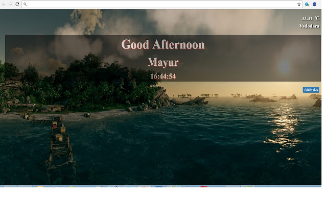
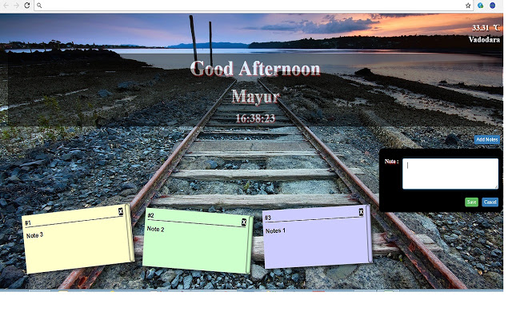

# ProTab - Chrome new tab extension. 

It replaces new tab page with a personal dashboard featuring notes, weather, and day wish,time,etc. Make your each tab special with new images. Make your each tab pro.

Made with HTML, CSS, Javascript, jQuery, Bootstrap

## Features

* On each new tab - new image
* Weather
* Day wishes
* Time
* To Do

## Published on Chrome Web Store

[ProTab](https://chrome.google.com/webstore/detail/protab/gjompmlfihjiiidknojjnjaeifhgblhj?hl=en)

## How to run on local?

```
git clone https://github.com/mayur091193/ProTab.git
```

[chrome://extensions/](http://chrome://extensions/)

Click Load Unpacked(On top left) and select the cloned folder(ProTab) - This will add ProTab local extension to the Chrome.


## Screens UI




